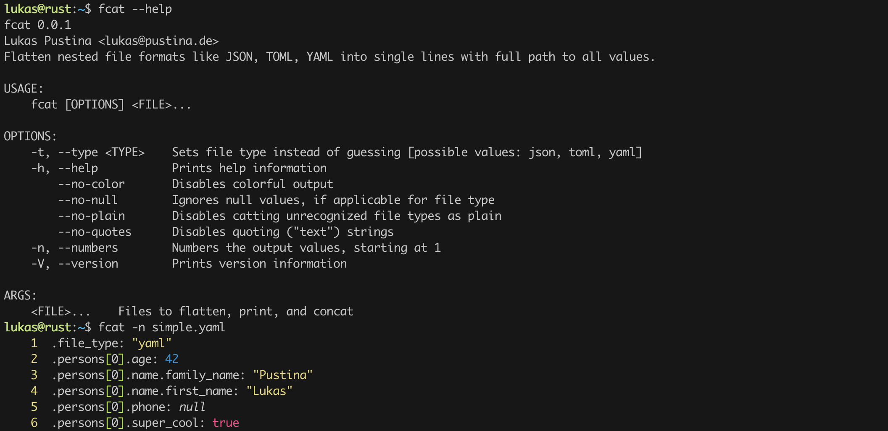

# FlatCat

Flatten nested file formats like JSON, TOML, YAML into single lines with full path to all values.

[](https://github.com/lukaspustina/flatcat/actions/workflows/ci.yml) [](https://github.com/lukaspustina/flatcat/releases)  

`flatcat`'s main purpose it to allow to use standard UNIX file commands like `grep`, `awk`, and `sed` to parse nested and hierarchical file formats like JSON, TOML, YAML etc. These files have become the de-facto standard for configurations, but there is little support to deal with these files. `flatcat` helps here by allowing flatten the hierarchical structures into single lines per value with each line containing the whole path to the value.

Of course there are similar tools like [jq](https://github.com/stedolan/jq) for JSON and [yq](https://github.com/mikefarah/yq) for YAML, but they are primarily suited to directly query the data structures which requires you to know what your actually looking for. `flatcat` tries to help to discover these paths -- see the [examples](#examples) section.

## Features

- Supports JSON, TOML, YAML, and more format are coming.
- Supports colorful output to ease readability
- Allows to ignore `Null` values
- Unrecognized file formats are printed as they are plainly

## Quick Start

1. Install `flatcat` – see below for [installation instructions](#installation).

2. Run `fcat -n <file>` on any file you like. If it's a supported format, it will be flattened. 

3. Set shell alias `alias cat=fcat -n` to replace your system’s `cat` command.

## Table of Contents
<!-- START doctoc generated TOC please keep comment here to allow auto update -->
<!-- DON'T EDIT THIS SECTION, INSTEAD RE-RUN doctoc TO UPDATE -->

- [Examples](#examples)
  - [YAML](#yaml)
    - [Flatten the YAML file.](#flatten-the-yaml-file)
    - [Search for path to value](#search-for-path-to-value)
- [Installation](#installation)
  - [Docker](#docker)
  - [Homebrew](#homebrew)
  - [Debian and Ubuntu](#debian-and-ubuntu)
  - [Redhat and Fedora](#redhat-and-fedora)
  - [For Rust Developers](#for-rust-developers)
  - [From Source](#from-source)
- [Changelog](#changelog)
- [Limitations](#limitations)
- [Postcardware](#postcardware)

<!-- END doctoc generated TOC please keep comment here to allow auto update -->

## Examples

### YAML

Let's say, you have a configuration file in YAML for persons like this:

```yaml
---
persons:
  - age: 42
    name:
      family_name: Pustina
      first_name: Lukas
    phone:
    super_cool: true
```

#### Flatten the YAML file.

```bash
> fcat -n simple.yaml
    1  .persons[0].age: 42
    2  .persons[0].name.family_name: "Pustina"
    3  .persons[0].name.first_name: "Lukas"
    4  .persons[0].phone: null
    5  .persons[0].super_cool: true
```

#### Search for path to value

Now, let's try to find the path to the my first name:

```bash
> fcat simple.yaml | grep Lukas
.persons[0].name.first_name: "Lukas"
```


## Installation

### Docker

If you want to give `flatcat` a quick spin and just try it out without too much hassle, you might want to try the Docker image:

```sh
$ docker run lukaspustina/flatcat:latest fcat <file>
```

### Homebrew

You can add this repository as a custom tap and then install `flatcat` like this:

```sh
$ brew tap lukaspustina/flatcat https://github.com/lukaspustina/flatcat.git
$ brew install lukaspustina/flatcat/flatcat
```

### Debian and Ubuntu

You can find Debian packages on the [GitHub Release](https://github.com/lukaspustina/flatcat/releases) page. Download the package as `flatcat.deb` and the run

```sh
$ dpkg -i flatcat.deb
```

### Redhat and Fedora

You can find RPM packages on the [GitHub Release](https://github.com/lukaspustina/flatcat/releases) page. Download the package as `flatcat.rpm` and the run

```sh
$ rpm -i flatcat.rpm
```

### For Rust Developers

```sh
$ cargo install flatcat
```

### From Source

Please install Rust via [rustup](https://www.rustup.rs) and then run

```sh
$ git clone https://github.com/lukaspustina/flatcat
$ cd flatcat
$ make install
```


## Changelog

Please see the [CHANGELOG](CHANGELOG.md) for a release history.


## Limitations

- Currently, all formats are parsed into memory before printing paths and values. Thus, `flatcat` is memory-bound. This limitation does not apply to plain file printing.


## Postcardware

You’re free to use `flatcat`. If you find it useful, I would highly appreciate you sending me a postcard from your hometown mentioning how you use `flatcat`. My work address is

```plain
     Lukas Pustina
     CenterDevice GmbH
     Rheinwerkallee 3
     53227 Bonn
     Germany
```

